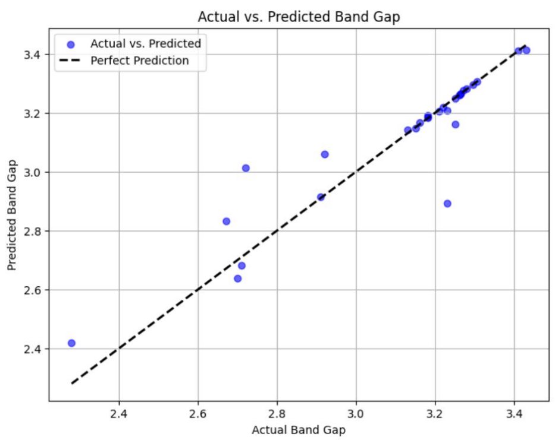
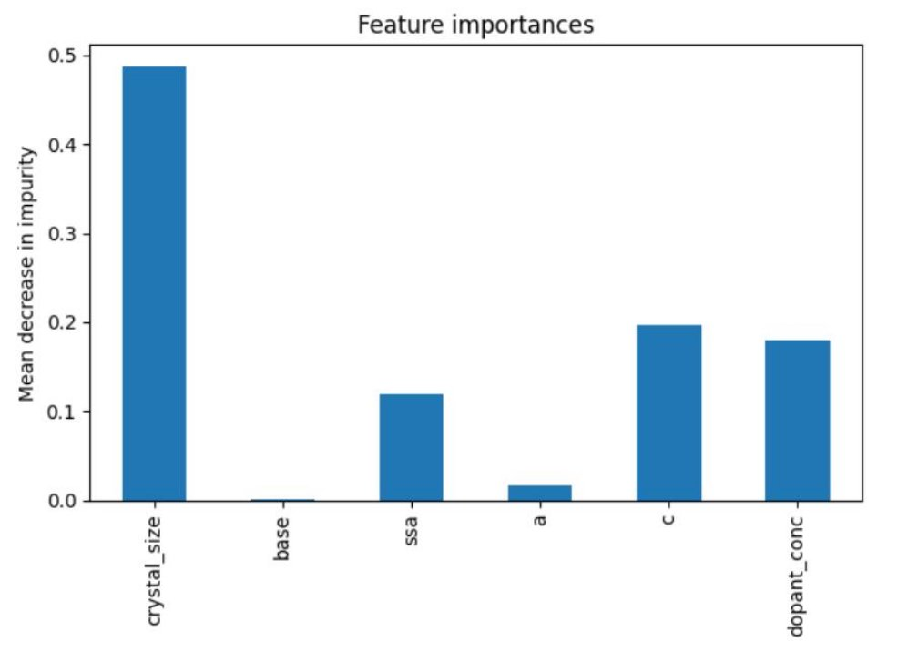

# Band-Gap-Prediction-ML

The aim is to predict the band gap of a doped oxide given its crystal parameters and other physical properties such as crystal size and specific surface area using machine learning models and to find the parameters most influencing the band gap of the oxides from the selected features.
The random Forest model achieves an **r2 score of 0.8544**

Plot of feature importance-

